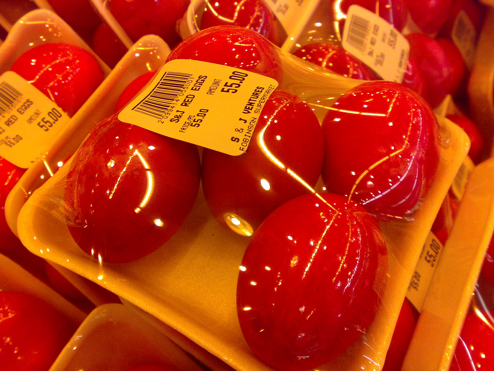

フルーツには適度な甘みと酸味の爽やかさがあって、毎日食べても飽きません。パンやヨーグルトとの相性もばっちりです。朝食にたくさんのフルーツを取り入れてみると、いつの間にかたくさんのフルーツを食べるようになっていました。

## フルーツの旬を活かす

野菜と同じようにフルーツにも旬があります。ただ、地域によって旬の時期には違いがありますので、居住地域の旬を押さえておくのがオススメです。

早い時期に入手できる果物はラズベリーとブルーベリーです。これらの果物は生で食べることも、乾燥させてデザートとして調理することもできます。少し甘くて酸味があります。また、ベリーから作るブルーベリーワインもあります。
次はイチゴですが、今年の前半はイチゴジャムが新鮮です。火を通さずそのまま食べるのがおいしいです。

パンとの組み合わせもいろいろ試してみましたが、とくにライ麦パンがとても気に入りました！ クリームとハチミツ、塩少々、バター少々に果物を加えるとペロッと食べられます。
