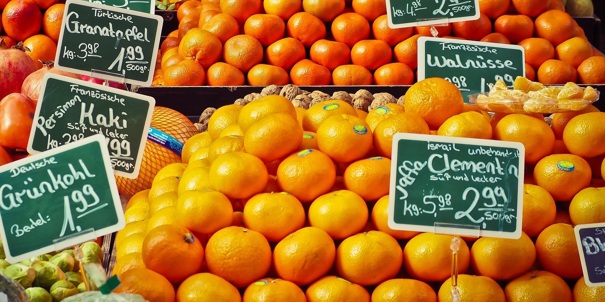

遠目にもぱっと目につく鮮やかなオレンジ色。緑の木々の中でも、ショッピングセンターの一角でも、その色の鮮やかさは変わりません。オレンジ色にも細かな違いがあり、黄色よりだったり、ピンク味が強い種類もあります。

果実の色にも、黄色のもの、淡黄色のもの、オレンジ色のもの、緑色のものなどがあり、「柔らかい黄色」「柔らかいオレンジ」などと表現されることもあります。細かくは果実の種類によっても異なります。

色味の違いは味の違いにもつながっていて、その果物はとても甘い味がして、一部の人のお気に入りになっています。ほんのり柑橘系の香りもします。味は果物と果物の組み合わせなのです。
