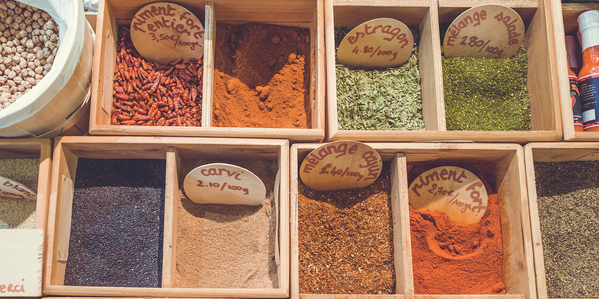

食事をさらにおいしくしてくれるのがスパイスです。その香りと刺激は、単調な料理にも大きなアクセントを加えてくれます。フルーツに合うスパイスもあります。

適切な割合のスパイスを使用すると、料理に豊かな味とよりエキゾチックな味を与えることができます。

## スパイスのブレンド

シナモンやカルダモンは一般的なスパイスブレンドですが、必ずしも多くのレシピに含まれているわけではありません。他の一般的なブレンドには、ブラックペッパーとブラックカルダモンを含んだものなどがあります。

いろいろなスパイス
スープやシチューはスパイスを組み合わせて調理されることが多く、スパイスをブレンドして調理されることもよくあります。

## その他のスパイス

チリやネギもよく使われます。もっとスパイスを効かせたい場合は、コリアンダー、ローリエ、コショウ、クローブ、タイム、フェンネル、パセリなどの新鮮なスパイスを使ってみてください。

採れたてのスパイスはその香りも強烈です。
