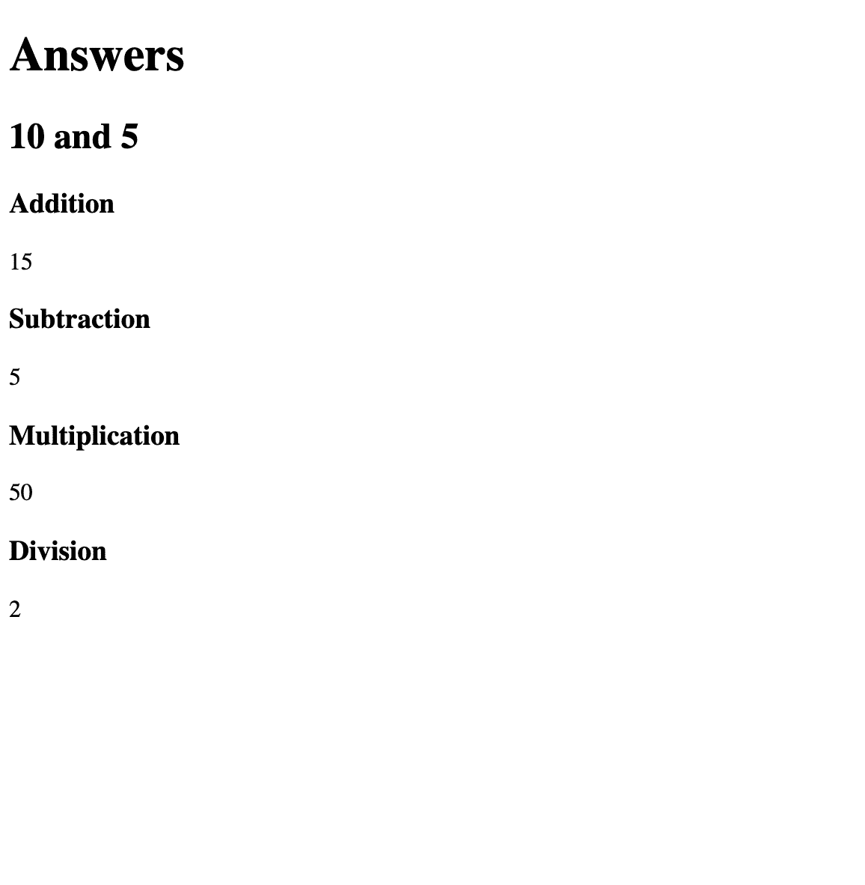

**webpack** used to be a frustrating and overwhelming beast to me. I felt safe using something like `create-react-app` to set up a project, but I avoided webpack if at all possible since it seemed complex and confusing.

<details open><summary>ほぼほぼGoogle翻訳</summary><div>

**webpack**は、私にとって苛立たしくて圧倒的な獣でした。 `create-react-app`のようなものを使ってプロジェクトを設定するのは安全だと感じましたが、複雑で混乱しているように見えたので、可能な限りwebpackを避けました。
</div></details>

If you don't feel comfortable setting up webpack from scratch for use with Babel, TypeScript, Sass, React, or Vue, or don't know why you might want to use webpack, then this is the perfect article for you. Like all things, once you delve in and learn it you realize it's not that scary and there's just a few main concepts to learn to get set up.

In addition to this article, I've created an extremely solid [webpack 5 Boilerplate](https://github.com/taniarascia/webpack-boilerplate) to get you started with any project. I also recommend checking it out if you're familiar with webpack 4 but want to see a webpack 5 setup.

<details open><summary>Google翻訳（ときどき意訳）</summary><div>

この記事に加えて、私は非常に堅実な[webpack 5ボイラープレート](https://github.com/taniarascia/webpack-boilerplate)を作成して、あらゆるプロジェクトを開始できるようにしました。 また、webpack4に精通しているが、`webpack5`のセットアップを確認したい場合は、チェックすることをオススメします。
</div></details>

#### Prerequisites

- Basic familiarity with [HTML & CSS](https://internetingishard.com/)

- Basic knowledge of [JavaScript](https://www.digitalocean.com/community/tutorial_series/how-to-code-in-javascript) and programming

- Familiarity with [ES6 syntax and features](https://www.taniarascia.com/es6-syntax-and-feature-overview/)
- Ability to set up a [Node.js environment](https://www.taniarascia.com/how-to-install-and-use-node-js-and-npm-mac-and-windows/)

- Knowledge of [the command line](https://www.taniarascia.com/how-to-use-the-command-line-for-apple-macos-and-linux/)

#### Goals

- Learn what webpack is and why you might want to use it

- Set up a development server with webpack

- Set up a production build flow using webpack

#### Content

- [What is webpack](https://www.taniarascia.com/how-to-use-webpack/#what-is-webpack)

- [Installation](https://www.taniarascia.com/how-to-use-webpack/#installation)

- [Basic configuration](https://www.taniarascia.com/how-to-use-webpack/#basic-configuration)
  - [Entry](https://www.taniarascia.com/how-to-use-webpack/#entry)
  - [Output](https://www.taniarascia.com/how-to-use-webpack/#output)

- [Plugins](https://www.taniarascia.com/how-to-use-webpack/#plugins)
  - [HTML template](https://www.taniarascia.com/how-to-use-webpack/#html-template-file)
  - [Clean](https://www.taniarascia.com/how-to-use-webpack/#clean)

- [Modules and Loaders](https://www.taniarascia.com/how-to-use-webpack/#modules-and-loaders)
  - [Babel (JavaScript)](https://www.taniarascia.com/how-to-use-webpack/#babel--javascript-)
  - [Images](https://www.taniarascia.com/how-to-use-webpack/#images)
  - [Fonts and inline](https://www.taniarascia.com/how-to-use-webpack/#fonts-and-inline)
  - [Styles](https://www.taniarascia.com/how-to-use-webpack/#styles)

- [Development](https://www.taniarascia.com/how-to-use-webpack/#development)

>If you're upgrading from webpack 4 to webpack 5, here are a few notes:
>
>- the `webpack-dev-server` command is now `webpack-serve`
>- `file-loader`, `raw-loader` and `url-loader` are not necessary, you can use built in [asset modules](https://webpack.js.org/guides/asset-modules/)
>- Node polyfills are no longer available, so if you get an error for `stream`, for example, you would add the `stream-browserify` package as a dependency and add `{ stream: 'stream-browserify' }` to the alias property in your webpack config.

## What is webpack?

For the most part, websites are no longer just written in plain HTML with a bit of optional JavaScript - they're often entirely built by JavaScript. So we have to bundle, minify, and transpile the code into something all browsers understand, which is where webpack comes in.

[webpack](https://webpack.js.org/) is a module bundler. It packs all your code neatly for the browser. It allows you to write the latest JavaScript with Babel or use TypeScript, and compile it into something cross-browser compatible and neatly minified. It also allows you to import static assets into your JavaScript.

For development, webpack also supplies a development server that can update modules and styles on the fly when you save. `vue create` and `create-react-app` rely on webpack under the hood, but you can easily set up your own webpack config for them.

There is much more that webpack can do, but this article will help you get familiar with the concepts and get something set up.

## Installation

First, create a directory for your project to live and start a Node project. I'm calling it `webpack-tutorial`.

```bash
mkdir webpack-tutorial
cd webpack-tutorial
npm init -y # creates a default package.json
```

To begin, install `webpack` and `webpack-cli`. These are the core technologies for getting set up.

```bash
npm i -D webpack webpack-cli
```

- `webpack` - Module and asset bundler

- `webpack-cli` - Command line interface for webpack

We'll make an `src` folder to contain all the source files. I'll start by creating a simple `index.js` file.

<div class="filename">src/index.js</div>

```js
console.log('Interesting!')
```

Alright, so now you have a Node project with the base packages installed and an index file to start. We'll begin creating the config files now.

## Basic configuration

Let's start setting up a webpack build. Create a `webpack.config.js` in the root of your project.

### Entry

The first part of setting up a webpack config is defining the **entry point**, what file or files webpack will look at to compile. In this example, we'll set the entry point to the `src/index.js`.

<div class="filename">webpack.config.js</div>

```js
const path = require('path')

module.exports = {
  entry: {
    main: path.resolve(__dirname, './src/index.js'),
  },
}
```

### Output

The output is where the bundled file will resolve. We'll have it output in the `dist` folder, which is where production code gets built. The `[name]` in the output will be `main`, as specified in the entry object.

<div class="filename">webpack.config.js</div>

```js
module.exports = {
  /* ... */

  output: {
    path: path.resolve(__dirname, './dist'),
    filename: '[name].bundle.js',
  },
}
```

Now we have the minimum config necessary to build a bundle. In `package.json`, we can make a `build` script that runs the `webpack` command.

<div class="filename">package.json</div>

```js
"scripts": {
  "build": "webpack"
}
```

Now you can run it.

```bash
npm run build
```

```terminal
asset main.bundle.js 19 bytes [emitted] [minimized] (name: main)
./src/index.js 18 bytes [built] [code generated]
webpack 5.1.0 compiled successfully in 152 mss
```

You'll see that a `dist` folder has been created with `main.bundle.js`. Nothing has happened to the file yet, but we now have webpack building successfully.

## Plugins

webpack has a [plugin](https://webpack.js.org/concepts/plugins/) interface that makes it flexible. Internal webpack code and third party extensions use plugins. There are a few main ones almost every webpack project will use.

### HTML template file

So we have a random bundle file, but it's not very useful to us yet. If we're building a web app, we need an HTML page that will load that JavaScript bundle as a script. Since we want the HTML file to automatically bring in the script, we'll create an HTML template with `html-webpack-plugin`.

- [`html-webpack-plugin`](https://github.com/jantimon/html-webpack-plugin) - Generates an HTML file from a template

Install the plugin.

```bash
npm i -D html-webpack-plugin
```

Create a `template.html` file in the `src` folder. We can include variables other custom information in the template. We'll add a custom `title`, and otherwise it will look like a regular HTML file with a `root` div.

<div class="filename">src/template.html</div>

```html
<!DOCTYPE html>
<html lang="en">
  <head>
    <title><%= htmlWebpackPlugin.options.title %></title>
  </head>

  <body>
    <div id="root"></div>
  </body>
</html>
```

Create a `plugins` property of your config and you'll add the plugin, filename to output (`index.html`), and link to the template file it will be based on.

<div class="filename">webpack.config.js</div>

```js{2, 7-13}
const path = require('path')
const HtmlWebpackPlugin = require('html-webpack-plugin')

module.exports = {
  /* ... */

  plugins: [
    new HtmlWebpackPlugin({
      title: 'webpack Boilerplate',
      template: path.resolve(__dirname, './src/template.html'), // template file
      filename: 'index.html', // output file
    }),
  ],
}
```

Now run a build again. You'll see the `dist` folder now contains an `index.html` with the bundle loaded in. Success! If you load that file into a browser, you'll see `Interesting!` in the console.

Let's update it to inject some content into the DOM. Change the `index.js` entry point to this, and run the build command again.

<div class="filename">src/index.js</div>

```js
// Create heading node
const heading = document.createElement('h1')
heading.textContent = 'Interesting!'

// Append heading node to the DOM
const app = document.querySelector('#root')
app.append(heading)
```

Now to test it out you can go to the `dist` folder and start up a server. (Install [http-server](https://www.npmjs.com/package/http-server) globally if necessary.)

```bash
http-server
```

You'll see our JavaScript injected into the DOM, saying "Interesting!". You'll also notice the bundle file is minified.

### Clean

You'll also want to set up `clean-webpack-plugin`, which clears out anything in the `dist` folder after each build. This is important to ensure no old data gets left behind.

- [`clean-webpack-plugin`](https://github.com/johnagan/clean-webpack-plugin) - Remove/clean build folders

<div class="filename">webpack.config.js</div>

```js
const path = require('path')

const HtmlWebpackPlugin = require('html-webpack-plugin')
const {CleanWebpackPlugin} = require('clean-webpack-plugin')

module.exports = {
  /* ... */

  plugins: [
    /* ... */
    new CleanWebpackPlugin(),
  ],
}
```

## Modules and Loaders

webpack uses [loaders](https://webpack.js.org/loaders/) to preprocess files loaded via [modules](https://webpack.js.org/concepts/modules/). This can be JavaScript files, static assets like images and CSS styles, and compilers like TypeScript and Babel. webpack 5 has a few built-in loaders for assets as well.

In your project you have an HTML file that loads and brings in some JavaScript, but it still doesn't actually do anything. What are the main things we want this webpack config to do?

- Compile the latest and greatest JavaScript to a version the browser understands

- Import styles and compile SCSS into CSS

- Import images and fonts

- (Optional) Set up React or Vue

First thing we'll do is set up Babel to compile JavaScript.

### Babel (JavaScript)

[Babel](https://babeljs.io/) is a tool that allows us to use tomorrow's JavaScript, today.

We're going to set up a rule that checks for any `.js` file in the project (outside of `node_modules`) and uses the `babel-loader` to transpile. There are a few additional dependencies for Babel as well.

- [`babel-loader`](https://webpack.js.org/loaders/babel-loader/) - Transpile files with Babel and webpack.

- [`@babel/core`](https://www.npmjs.com/package/@babel/core) - Transpile ES2015+ to backwards compatible JavaScript

- [`@babel/preset-env`](https://babeljs.io/docs/en/babel-preset-env) - Smart defaults for Babel

- [`@babel/plugin-proposal-class-properties`](https://babeljs.io/docs/en/babel-plugin-proposal-class-properties) - An example of a custom Babel config (use properties directly on a class)

```bash
npm i -D babel-loader @babel/core @babel/preset-env @babel/preset-env @babel/plugin-proposal-class-properties
```

<div class="filename">webpack.config.js</div>

```js{4-13}
module.exports = {
  /* ... */

  module: {
    rules: [
      // JavaScript
      {
        test: /\.js$/,
        exclude: /node_modules/,
        use: ['babel-loader'],
      },
    ],
  },
}
```

>If you're setting up a TypeScript project, you would use the `typescript-loader` instead of `babel-loader` for all your JavaScript transpiling needs. You would check for `.ts` files and use `ts-loader`.

Now Babel is set up, but our Babel plugin is not. You can demonstrate it not working by adding an example pre-Babel code to `index.js`.

<div class="filename">src/index.js</div>

```js{1-8}
// Create a class property without a constructor
class Game {
  name = 'Violin Charades'
}
const myGame = new Game()
// Create paragraph node
const p = document.createElement('p')
p.textContent = `I like ${myGame.name}.`

// Create heading node
const heading = document.createElement('h1')
heading.textContent = 'Interesting!'

// Append SVG and heading nodes to the DOM
const app = document.querySelector('#root')
app.append(heading, p)
```

```terminal
ERROR in ./src/index.js
Module build failed (from ./node_modules/babel-loader/lib/index.js):
SyntaxError: /Users/you/webpack-tutorial/src/index.js: Support for the experimental syntax 'classProperties' isn't currently enabled (3:8):

  1 | // Create a class property without a constructor
  2 | class Game {
> 3 |   name = 'Violin Charades'
    |        ^
  4 | }
```

To fix this, simply create a `.babelrc` file in the root of your project. This will add a lot of defaults with `preset-env` and the plugin we wanted with `plugin-proposal-class-properties`.

<div class="filename">.babelrc</div>

```json
{
  "presets": ["@babel/preset-env"],
  "plugins": ["@babel/plugin-proposal-class-properties"]
}
```

Now another `npm run build` and everything will be all set.

### Images

You'll want to be able to import images directly into your JavaScript files, but that's not something that JavaScript can do by default. To demonstrate, create `src/images` and add an image to it, then try to import it into your `index.js` file.

<div class="filename">src/index.js</div>

```js
import example from './images/example.png'

/* ... */
```

When you run a build, you'll once again see an error:

```terminal
ERROR in ./src/images/example.png 1:0
Module parse failed: Unexpected character '�' (1:0)
You may need an appropriate loader to handle this file type, currently no loaders are configured to process this file. See https://webpack.js.org/concepts#loaders
```

webpack has some built in [asset modules](https://webpack.js.org/guides/asset-modules/) you can use for static assets. For image types, we'll use `asset/resource`. Note that this is a type and not a `loader`.

<div class="filename">webpack.config.js</div>

```js{5-9}
module.exports = {
  /* ... */
  module: {
    rules: [
      // Images
      {
        test: /\.(?:ico|gif|png|jpg|jpeg)$/i,
        type: 'asset/resource',
      },
    ],
  },
}
```

You'll see the file got output to the `dist` folder after building.

### Fonts and inline

webpack also has an asset module to inline some data, like svgs and fonts, using the `asset/inline` type.

<div class="filename">src/index.js</div>

```js
import example from './images/example.svg'

/* ... */
```

<div class="filename">webpack.config.js</div>

```js{5-9}
module.exports = {
  /* ... */
  module: {
    rules: [
      // Fonts and SVGs
      {
        test: /\.(woff(2)?|eot|ttf|otf|svg|)$/,
        type: 'asset/inline',
      },
    ],
  },
}
```

### Styles

Using a style loader is necessary to be able to do something like `import 'file.css'` in your scripts.

A lot of people these days are using [CSS-in-JS](https://cssinjs.org/), [styled-components](https://styled-components.com/), and other tools to bring styles into their JavaScript apps.

Sometimes, just being able to load in a CSS file is sufficient. This website just has a single CSS file. Maybe you want to use [PostCSS](https://postcss.org/), which allows you to use all the latest CSS features in any browser. Or maybe you want to use [Sass](https://sass-lang.com/), the CSS preprocessor.

I want to use all three - write in Sass, process in PostCSS, and compile to CSS. That involves bringing in a few loaders and dependencies.

- [`sass-loader`](https://webpack.js.org/loaders/sass-loader/) - Load SCSS and compile to CSS
  - [`node-sass`](https://github.com/sass/node-sass) - Node Sass

- [`postcss-loader`](https://webpack.js.org/loaders/postcss-loader/) - Process CSS with PostCSS
  - [`postcss-preset-env`](https://www.npmjs.com/package/postcss-preset-env) - Sensible defaults for PostCSS

- [`css-loader`](https://webpack.js.org/loaders/css-loader/) - Resolve CSS imports

- [`style-loader`](https://webpack.js.org/loaders/style-loader/) - Inject CSS into the DOM

```bash
npm i -D sass-loader postcss-loader css-loader style-loader postcss-preset-env node-sass
```

Just like with Babel, PostCSS will require a config file, so make that and add it to the root.

<div class="filename">postcss.config.js</div>

```js
module.exports = {
  plugins: {
    'postcss-preset-env': {
      browsers: 'last 2 versions',
    },
  },
}
```

In order to test out that Sass and PostCSS are working, I'll make a `src/styles/main.scss` with Sass variables and a PostCSS example (`lch`).

<div class="filename">src/styles/main.scss</div>

```scss
$font-size: 1rem;
$font-color: lch(53 105 40);

html {
  font-size: $font-size;
  color: $font-color;
}
```

Now import the file in `index.js` and add the four loaders. They compile from last to first, so the last one you'll want in the list is `sass-loader` as that needs to compile, then PostCSS, then CSS, and finally `style-loader`, which will inject the CSS into the DOM.

<div class="filename">src/index.js</div>

```js
import './styles/main.scss'

/* ... */
```

<div class="filename">webpack.config.js</div>

```js{5-9}
module.exports = {
  /* ... */
  module: {
    rules: [
      // CSS, PostCSS, and Sass
      {
        test: /\.(scss|css)$/,
        use: ['style-loader', 'css-loader', 'postcss-loader', 'sass-loader'],
      },
    ],
  },
}
```

Now when you rebuild, you'll notice the Sass and PostCSS has been applied.

>Note: This is a setup for development. For production, you will use `MiniCssExtractPlugin` instead of `style-loader`, which will export the CSS as a minified file. You can this in the [webpack 5 boilerplate](https://github.com/taniarascia/webpack-boilerplate).

## Development

Running `npm run build` every single time you make an update is tedious. The bigger your site gets, the longer it will take to build. You'll want to set up two configurations for webpack:

- a production config, that minifies, optimizes and removes all source maps

- a development config, that runs webpack in a server, updates with every change, and has source maps

Instead of building to a `dist` file, the development mode will just run everything in memory.

To set up for development, you'll install webpack-dev-server.

- [`webpack-dev-server`](https://github.com/webpack/webpack-dev-server) - Development server for webpack

```bash
npm i -D webpack-dev-server
```

For demonstrative purposes, we can just add the development config to the current `webpack.config.js` file we're building and test it out. However, you'll want to create two config files: one with `mode: production` and one with `mode: development`. In the [webpack 5 boilerplate](https://github.com/taniarascia/webpack-boilerplate), I demonstrate how to use `webpack-merge` to put all the base webpack config in one file, and any special development or production configs in a `webpack.prod.js` and `webpack.dev.js` files.

```js
const webpack = require('webpack')

module.exports =  {
  /* ... */
  mode: 'development',
  devServer: {
    historyApiFallback: true,
    contentBase: path.resolve(__dirname, './dist'),
    open: true,
    compress: true,
    hot: true,
    port: 8080,
  },

  plugins: [
    /* ... */
    // Only update what has changed on hot reload
    new webpack.HotModuleReplacementPlugin(),
  ],
})
```

We're adding `mode: development`, and creating a `devServer` property. I'm setting a few defaults on it - the port will be `8080`, it will automatically open a browser window, and uses [hot-module-replacement](https://webpack.js.org/concepts/hot-module-replacement/), which requires the `webpack.HotModuleReplacementPlugin` plugin. This will allow modules to update without doing a complete reload of the page - so if you update some styles, just those styles will change, and you won't need to reload the entirety of the JavaScript, which speeds up development a lot.

Now you'll use the `webpack serve` command to set up the server.

<div class="filename">package.json</div>

```json
"scripts": {
  "start": "webpack serve"
}
```

```bash
npm start
```

When you run this command, a link to `localhost:8080` will automatically pop up in your browser. Now you can update Sass and JavaScript and watch it update on the fly.

## Conclusion

That should help you get started with webpack. Once again, I've created a production-ready webpack 5 boilerplate, with Babel, Sass, PostCSS, production optimization, and a development server, that has everything from this article but goes into more details. From here, you can easily set up React, Vue, TypeScript, or anything else you might want.

- [webpack 5 boilerplate](https://github.com/taniarascia/webpack-boilerplate)

Check it out, play around with it, and enjoy!

### image test




*test image*

*
/Users/takeru/Learn/＠MYSITE/my-site/node_modules/gatsby/dist/utils/babel-loader.js??ruleSet[1].rules[2].use[0]!
/Users/takeru/Learn/＠MYSITE/my-site/src/components/Layout.js

    Used by 2 module(s), i. e.

/Users/takeru/Learn/＠MYSITE/my-site/node_modules/gatsby/dist/utils/babel-loader.js??ruleSet[1].rules[2].use[0]!
/Users/takeru/Learn/＠MYSITE/my-site/src/pages/index.js


*
/Users/takeru/Learn/＠MYSITE/my-site/node_modules/gatsby/dist/utils/babel-loader.js??ruleSet[1].rules[2].use[0]!
/Users/takeru/Learn/＠MYSITE/my-site/src/components/layout.js

    Used by 1 module(s), i. e.

/Users/takeru/Learn/＠MYSITE/my-site/node_modules/gatsby/dist/utils/babel-loader.js??ruleSet[1].rules[2].use[0]!
/Users/takeru/Learn/＠MYSITE/my-site/src/pages/404.js
